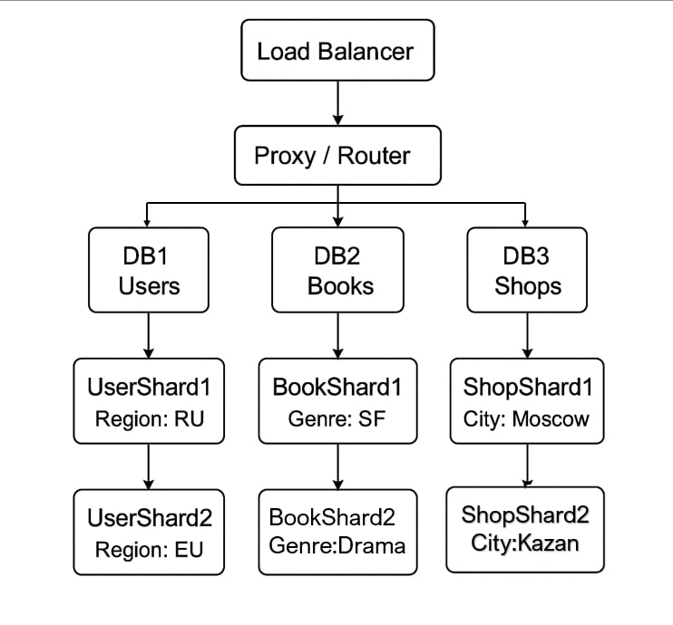
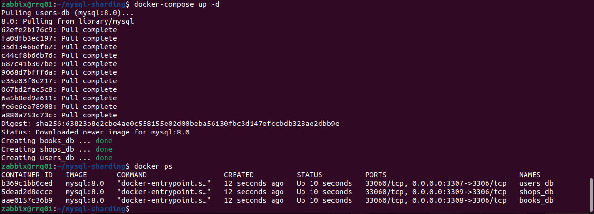
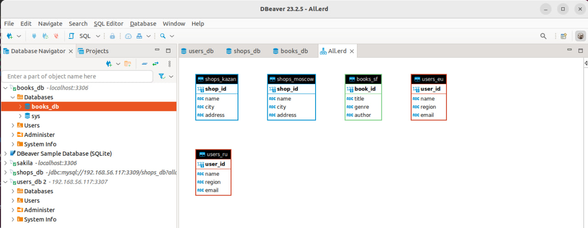

# "Домашнее задание к занятию «Репликация и масштабирование. Часть 2»" - Хомяков Антон.

### Задание 1

Опишите основные преимущества использования масштабирования методами:
- активный master-сервер и пассивный репликационный slave-сервер; 
- master-сервер и несколько slave-серверов;
- активный сервер со специальным механизмом репликации — distributed replicated block device (DRBD);
- SAN-кластер.

*Дайте ответ в свободной форме.*

### Решение 1

Методы масштабирования и их примущества:
1. Активный master-сервер и пассивный репликационный slave-сервер:

Один сервер (master) обрабатывает и чтение, и запись. Второй (slave) — просто резервная копия. Он не обслуживает запросы, а лишь получает данные через репликацию.

Плюсы:

Надёжность: если master упадёт, можно вручную переключиться на slave.
Простота реализации: достаточно базовой репликации.
Отличный вариант для старта — минимум лишней логики.

2. Master-сервер и несколько slave-серверов (Master-Slave)
:
Один сервер (master) занимается всеми записями, остальные (slaves) читают данные. Репликация идёт только от master к slave.

Плюсы:

Разгрузка: master пишет, slaves читают — меньше нагрузка на каждый узел.
Масштабирование по чтению: можно добавлять slaves, если растёт число клиентов.
Надёжность: если master упадёт — можно вручную или автоматически сделать одного из slaves новым master.

3. Активный сервер с репликацией через DRBD (Distributed Replicated Block Device):

DRBD — это синхронная или асинхронная репликация на уровне блочных устройств. То есть копируются не сами таблицы, а куски диска.

Плюсы:

Почти идеальное зеркало: slave содержит точную копию диска master’а.
Высокая надёжность при сбоях — подходит для отказоустойчивых систем.
Может использоваться вместе с кластерным ПО (Pacemaker/Corosync) для автоматического переключения.

4. SAN-кластер (Storage Area Network):

Объединённые серверы (ноды) используют одно общее хранилище — через SAN.

Плюсы:

Высокая доступность: если одна нода падает — другая сразу подхватывает.
Централизованное хранение данных: легко управлять, бэкапить, масштабировать.
Отличная совместимость с кластерными файловыми системами и failover-решениями.

---
### Задание 2

Разработайте план для выполнения горизонтального и вертикального шаринга базы данных. База данных состоит из трёх таблиц: 

- пользователи, 
- книги, 
- магазины (столбцы произвольно). 

Опишите принципы построения системы и их разграничение или разбивку между базами данных.
*Пришлите блоксхему, где и что будет располагаться. Опишите, в каких режимах будут работать сервера.* 

### Решение 2

У нас есть три таблицы:
- users
- books
- shops.


- Вертикальный шардинг — по функциям.

Разделим таблицы по их роли:
| Сервер | Что хранит | Причина                                              |
| ------ | ---------- | ---------------------------------------------------- |
| DB1    | `users`    | Отдельная БД для авторизации, профилей и т.п.        |
| DB2    | `books`    | Хранение контента (много текста, метаданных)         |
| DB3    | `shops`    | Информация о наличии, ценах, связях с пользователями |

- Горизонтальный шардинг — по нагрузке и объёму

Делим данные внутри таблиц по критерию. 
Например:
- users — по стране/региону (Europe, Asia, America).
- books — по жанру или ID (shard1: ID 1–50000, shard2: 50001–100000).
- shops — по локации (Москва, СПб, Казань и т.д.)


#### Блок схема:


## Режимы работы серверов
- Все БД-серверы работают в Master-Slave-репликации, каждый master обслуживает запись, а его slaves — чтение.
- Proxy-сервер (например, ProxySQL) — управляет маршрутизацией запросов в зависимости от таблицы и параметров шардинга.
- Мониторинг и failover через Orchestrator или аналог.

### Примеры шардинга в реальных условиях:
| Таблица | Критерий   | Пример                               |
| ------- | ---------- | ------------------------------------ |
| `users` | по региону | `users_ru`, `users_eu`, `users_asia` |
| `books` | по ID      | ID 1–50K, 50K–100K                   |
| `shops` | по городу  | `shops_msk`, `shops_spb`             |


Дополнительные задания (со звёздочкой*)

Эти задания дополнительные, то есть не обязательные к выполнению, и никак не повлияют на получение вами зачёта по этому домашнему заданию. Вы можете их выполнить, если хотите глубже шире разобраться в материале.
#### Задание 3*

Выполните настройку выбранных методов шардинга из задания 2.

Пришлите конфиг Docker и SQL скрипт с командами для базы данных.

### Решение 3

Настройка шардинга в MySQL с помощью Docker и SQL-скриптов:

3 шардированных базы данных: users_db, books_db, shops_db

Каждая БД будет размещена в отдельном Docker-контейнере

Шардинг реализован по географии (пользователи, магазины) и жанру (книги)


### docker-compose.yml:
```
version: '3.9'

services:
  users-db:
    image: mysql:8.0
    container_name: users_db
    restart: always
    environment:
      MYSQL_ROOT_PASSWORD: rootpass
      MYSQL_DATABASE: users_db
    ports:
      - "3307:3306"
    volumes:
      - ./sql/users_init.sql:/docker-entrypoint-initdb.d/init.sql
	  - ./mysql_data/users:/var/lib/mysql

  books-db:
    image: mysql:8.0
    container_name: books_db
    restart: always
    environment:
      MYSQL_ROOT_PASSWORD: rootpass
      MYSQL_DATABASE: books_db
    ports:
      - "3308:3306"
    volumes:
      - ./sql/books_init.sql:/docker-entrypoint-initdb.d/init.sql
	  - ./mysql_data/books:/var/lib/mysql

  shops-db:
    image: mysql:8.0
    container_name: shops_db
    restart: always
    environment:
      MYSQL_ROOT_PASSWORD: rootpass
      MYSQL_DATABASE: shops_db
    ports:
      - "3309:3306"
    volumes:
      - ./sql/shops_init.sql:/docker-entrypoint-initdb.d/init.sql
	  - ./mysql_data/shops:/var/lib/mysql
```
### SQL Скрипты:

# sql/users_init.sql:
```
CREATE DATABASE IF NOT EXISTS users_db;
USE users_db;

CREATE TABLE IF NOT EXISTS users_ru (
    user_id INT AUTO_INCREMENT PRIMARY KEY,
    name VARCHAR(100),
    region VARCHAR(50) DEFAULT 'RU',
    email VARCHAR(150)
);

CREATE TABLE IF NOT EXISTS users_eu (
    user_id INT AUTO_INCREMENT PRIMARY KEY,
    name VARCHAR(100),
    region VARCHAR(50) DEFAULT 'EU',
    email VARCHAR(150)
);
```

# sql/books_init.sql:
```
CREATE DATABASE IF NOT EXISTS books_db;
USE books_db;

CREATE TABLE IF NOT EXISTS books_sf (
    book_id INT AUTO_INCREMENT PRIMARY KEY,
    title VARCHAR(200),
    genre VARCHAR(50) DEFAULT 'Sci-Fi',
    author VARCHAR(100)
);

CREATE TABLE IF NOT EXISTS books_drama (
    book_id INT AUTO_INCREMENT PRIMARY KEY,
    title VARCHAR(200),
    genre VARCHAR(50) DEFAULT 'Drama',
    author VARCHAR(100)
);
```

# sql/shops_init.sql:
```
CREATE DATABASE IF NOT EXISTS shops_db;
USE shops_db;

CREATE TABLE IF NOT EXISTS shops_moscow (
    shop_id INT AUTO_INCREMENT PRIMARY KEY,
    name VARCHAR(150),
    city VARCHAR(100) DEFAULT 'Moscow',
    address TEXT
);

CREATE TABLE IF NOT EXISTS shops_kazan (
    shop_id INT AUTO_INCREMENT PRIMARY KEY,
    name VARCHAR(150),
    city VARCHAR(100) DEFAULT 'Kazan',
    address TEXT
);
```



---
